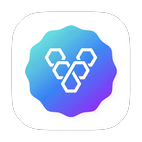
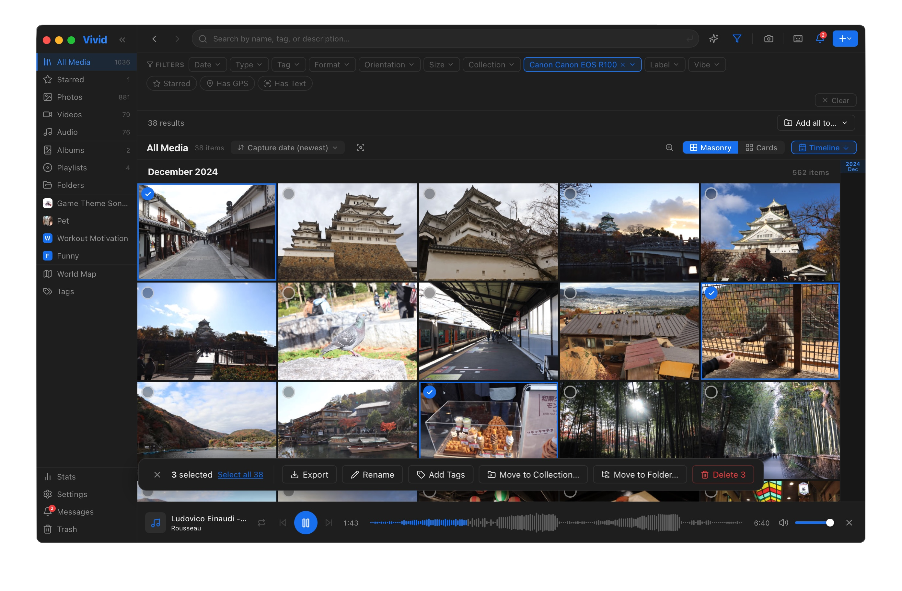

<div align="center">



# Vivid

**A fast, private, local-first media manager for macOS — with on-device AI.**

Organize photos, videos, and music in one place. Search your library by _meaning_ in 100+ languages, find text inside images, and keep everything on your machine. No cloud, no account, no telemetry.


</div>

---



## What it does

Vivid is a single home for **photos, videos, and audio**, with a focus on speed, privacy, and finding things easily.

### Library & organization

* **Multiple Workspaces**: Manage more than one library side by side — Vivid can neatly organize your assets on disk, or seamlessly link existing folders with **zero file replication**. Add, switch, and unlink workspaces anytime.
* Four dynamic layouts: **Masonry** (justified), **Cards** (uniform), **List**, and a chronological **Timeline** complete with a smooth date scrubber.
* Stay organized with photo albums, **album groups** (nest related albums together), dedicated music playlists, and nested folders. Albums can belong to multiple collections at once.
* **Interactive World Map**: Relive your travels by visualizing your GPS-tagged media on a global map, with multi-select (marquee-drag or Ctrl+click) to hide or isolate pins.
* **Frictionless Ingestion**: Import via drag-and-drop, direct downloads, mobile uploads, or set up **watched folders** for automatic background importing.
* **Set-and-Forget Backup**: Keep your critical data safe with an auto-file-sync feature that continuously backs up to a designated folder.
* **Pro-Grade Search**: Find anything instantly. Filter by name, tags, metadata, resolution, or text-in-image, narrow the search scope to just names/tags/description/OCR, and **bookmark searches** to revisit them later.
* **Curation Power Tools**: Batch-edit metadata, apply color labels, favorite your best shots, and instantly clean up clutter with built-in **duplicate detection**.

### On-device AI (100% private & optional)

* **Intelligent Auto-Tagging**: Effortlessly categorize your library with automatic scene and object recognition.
* **Semantic Search**: Type exactly what you remember—like *"sunset over the bridge"* or *"dog on a beach"*. Powered by multilingual SigLIP, it understands meaning across **100+ languages**.
* **Vision OCR**: Never lose a document again. Text inside screenshots, scans, and signs is fully indexed and searchable.
* **Visual Discovery**: Find the right aesthetic instantly with **mood / vibe filters** and a **"find visually similar"** engine.

### Built-in editing & tools

* **Essential Image Editing**: Quick, non-destructive tools to rotate, flip, resize, and crop your images on the fly.
* **Side-by-Side Comparison**: Evaluate your shots with a dedicated dual-image comparison tool to pick the perfect frame.
* An **integrated music player** complete with gorgeous album art, playlist management, and queue control.
* A feature-rich, high-performance **video player** built right into the app.
* **Instant Screenshots**: Capture your screen and instantly route the file straight into your library.
* **Library Insights**: Visualize your digital footprint with a beautiful **stats dashboard** breaking down your collection.

### Premium experience

* **Tailored Aesthetics**: Switch seamlessly between stunning light and dark themes, personalized with custom accent colors.
* **Globally Localized**: Fully native support for **11 languages**: English, Spanish, French, German, Portuguese, Vietnamese, 繁體中文, 简体中文, 日本語, 한국어, and हिन्दी.
* **Keyboard-Driven Viewer**: Fly through your media with powerful keyboard shortcuts for slideshows, zoom precision, and playback control.

---

## Why Vivid is different

- **Local-first and private by design.** Your library, your machine. No server to run, no account, no telemetry. AI runs on-device.
- **One app for _all_ your media.** Most tools specialize in photos _or_ music. Vivid handles images, video, and audio together — including downloads and basic editing.
- **Search by meaning, in any language.** On-device multilingual semantic search is rare in a desktop app you fully own.
- **OCR built in.** Find that screenshot by the words inside it.
- **Native and fast.** A Rust + Tauri core (tens of MB, not a bundled browser) instead of a heavy Electron stack.

---

## Download

Grab the latest `.dmg` from the **[Releases page](https://github.com/hsuanhauliu/vivid/releases/latest)**, then drag **Vivid** to your Applications folder.

Requires macOS 12+ (Apple Silicon). The optional AI model downloads on first use.

> ⚠️ **Vivid is an unsigned build** — the first launch needs one extra step. See **[First launch on macOS](#first-launch-on-macos)** below.

---

## First launch on macOS

Vivid is open source and isn't signed with a paid Apple Developer ID or notarized by Apple. Because of that, when you download the `.dmg` macOS attaches a "quarantine" flag and **Gatekeeper blocks the first launch** with a warning such as _"Vivid can't be opened because Apple cannot check it for malicious software"_ — or, on Apple Silicon, _"Vivid is damaged and can't be opened."_ (It isn't damaged — that's just how macOS labels unsigned downloads.)

This is a **one-time** step. Pick whichever you prefer:

**Option A — Right-click to open (no Terminal)**

1. In Applications, **right-click** (or Control-click) **Vivid** → **Open**.
2. Click **Open** in the dialog that appears.

That's it — macOS remembers your choice and launches normally from then on.

**Option B — "Open Anyway" in System Settings**

1. Double-click Vivid once (it'll be blocked).
2. Go to **System Settings → Privacy & Security**, scroll to the **Security** section, and click **Open Anyway** next to the Vivid message.

**Option C — Clear the quarantine flag (Terminal)**

If you see _"damaged and can't be opened"_ and Options A/B don't appear, remove the quarantine attribute directly:

```bash
xattr -dr com.apple.quarantine /Applications/Vivid.app
```

Then open Vivid normally.

> **Why?** Removing this warning entirely requires a $99/year Apple Developer account to sign **and notarize** the app — signing alone is no longer enough. As a free, open-source project, Vivid ships unsigned for now. The source is right here if you'd rather [build it yourself](#build-from-source).

---

## Uninstall

### Remove the app

Simply drag **Vivid** from Applications to the Trash, or:

```bash
rm -rf /Applications/Vivid.app
```

### Remove all data (complete cleanup)

All Vivid data — database, imported media files, downloaded tools (yt-dlp), and AI models — are stored in a single folder. To remove everything:

```bash
rm -rf ~/Library/Application\ Support/com.vivid.app
```

This also clears WebView localStorage (language, theme, onboarded flag).

### Keep imported media, reset everything else

If you want to preserve your media files but wipe the database and settings (useful for testing):

```bash
# Keep media files, remove database
rm ~/Library/Application\ Support/com.vivid.app/vivid.db

# Optionally also remove downloaded tools and models
rm -rf ~/Library/Application\ Support/com.vivid.app/bin
rm -rf ~/Library/Application\ Support/com.vivid.app/models
```

### Reset just the app state (language, theme, welcome flag)

Clear WebView localStorage while keeping your library and settings:

In the running app, open **Developer Tools** (Cmd+Option+I), then in the Console:

```js
localStorage.clear();
```

Press Cmd+R to reload. The welcome flow will return and language resets to system default.

---

## Build from source

### Prerequisites

| Requirement                                                 | Notes                                                                                           |
| ----------------------------------------------------------- | ----------------------------------------------------------------------------------------------- |
| **macOS 12 (Monterey) or later**                            | Apple Silicon recommended. Vivid uses Apple frameworks and tools (Vision, sips, screencapture). |
| **[Node.js](https://nodejs.org) 18+**                       | For the frontend (Vite + React).                                                                |
| **[Rust](https://rustup.rs) (stable)**                      | For the Tauri backend.                                                                          |
| **Xcode Command Line Tools**                                | `xcode-select --install` — required to compile the bundled Swift helper (`swiftc`).             |
| **[yt-dlp](https://github.com/yt-dlp/yt-dlp)** _(optional)_ | `brew install yt-dlp` — only needed for URL/playlist downloads.                                 |

### Run it

```bash
# 1. Clone
git clone https://github.com/hsuanhauliu/vivid.git
cd vivid

# 2. Install frontend dependencies
npm install

# 3. Run in development (hot reload)
npm run tauri dev

# 4. Build a distributable .app / .dmg
npm run tauri build
```

The first `tauri dev`/`build` compiles the Rust backend and the Swift helper, so it takes a few minutes. Subsequent runs are fast.

### Enabling the AI features (optional)

The core library works with **no downloads**. AI search, auto-tagging, and mood filters need a model:

- **In-app:** open **Settings → AI** and click **Download** next to _Visual AI_. (~1.4 GB, one time.)
- **Storage:** models are downloaded to `~/Library/Application Support/com.vivid.app/models/clip-multilingual/`.

The model runs **fully on-device** — nothing is ever uploaded.

---

## Limitations & honest caveats

- **macOS only.** Vivid leans on Apple frameworks and tools (Vision, sips, screencapture) and a Swift helper; it won't run on Windows/Linux today.
- **No mobile app and no built-in sync.** It's a single-machine desktop app. Pair it with your own backup/cloud-drive if you need off-device copies.
- **AI models are a large one-time download** (~1.4 GB for visual search), and indexing a big library takes CPU time the first time.
- **Building requires Xcode Command Line Tools** for the Swift helper.
- **Early days.** Vivid is at `v0.1` — expect rough edges, and please file issues.

---

## Tech stack & architecture

- **Shell:** [Tauri 2](https://tauri.app) — a native macOS app with a Rust core and a web UI (no bundled Chromium).
- **Frontend:** React 18 + Vite, `react-i18next`, Leaflet (maps), Lucide icons.
- **Backend (Rust):** SQLite via `rusqlite`, image processing via the `image` crate, audio metadata via `lofty`, EXIF via `kamadak-exif`.
- **AI inference:** [Candle](https://github.com/huggingface/candle) running multilingual SigLIP locally; Apple **Vision** OCR via a small bundled Swift helper compiled at build time.
- **External tools (optional):** `yt-dlp` for downloads; `ffmpeg` for legacy video format cropping; `sips`/`screencapture` ship with macOS.

```
vivid/
├── src/                  # React frontend
│   ├── components/       # UI (grid, viewer, panels, settings, …)
│   ├── hooks/            # useMediaLibrary, useNavHistory, useBackup, useNotifications
│   └── locales/          # en, es, fr, de, pt, vi, zh-TW, zh-CN, ja, ko, hi
└── src-tauri/
    ├── src/              # Rust backend (commands, db, AI, models)
    ├── swift/            # Swift helper (Vision OCR)
    └── tauri.conf.json
```

---

## About this project

Vivid is a personal media manager developed for myself and close friends and family. I've open-sourced it so others can use and modify it freely. **I'm not actively accepting feature PRs**, but bug fixes and forks are welcome — clone it and make it your own!

See [CONTRIBUTING.md](CONTRIBUTING.md) for details.

---

## Release

To cut a new release, use the following commands:

```bash
# runs the sync script and create commit
npm version patch   # or minor / major
git push --follow-tags  # Pushes the commit + tag together, triggering release.yml in CI/CD

# publish release once it's reviewed
TAG_VERSION=$(node -p "require('./package.json').version")
gh release edit "v$TAG_VERSION" --draft=false
```

---

## License

[MIT](LICENSE) © Hsuan-Hau Liu
